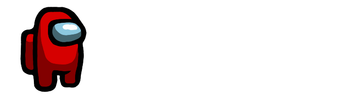

# SussyDB
Open source database using Node.JS with websockets.

## Why SussyDB?
SussyDB is a database that is designed to be fast and easy to use. No extra setup required. Just `node .`

### Features
- Fast
- Easy to use
- No extra setup required
- No extra dependencies
- No extra configuration
- (SOON) One-click install plugins like a web interface

## Installation
Clone the repository:

```
npm install
node .
```

## Usage
Connect to the websocket server:

```
ws://localhost:6942/ws

Change the port in sussysettings.json if needed.

Authenticate with your user by sending an 'auth' message:

{
  "type": "auth",
  "auth": {
    "name": "username",
    "pwd": "password"
  }
}
```

# CRUD
<details>
<summary>Inserting</summary>
Send a 'insert' message:

```
{
  "type": "crud",
  "crud": {
    "action": "insert",
    "db": "db",
    "collection": "collection",
    "data": {
      "key": "value"
    }
  }
}
```
You should receive something like this:

```
{
  "type": "crud",
  "crud": "[
    {"key":"value"}
  ]",
  "success":true
}
```
</details>
<br>
<details>
<summary>Find</summary>
Send a 'find' message:

```
{
  "type": "crud",
  "crud": {
    "action": "find",
    "db": "db",
    "collection": "collection",
    "query": {
      "key": "value"
    }
  }
}
```
You should receive something like this:

```
{
  "type": "crud",
  "crud": "[
    {"key":"value"}
  ]",
  "success":true
}
```
If it fails, you should receive something like this:

```
{
  "type": "crud",
  "crud": null,
  "success": false
}
```
</details>
<br>
<details>
<summary>Update</summary>
Send an 'update' message:

```
{
  "type": "crud",
  "crud": {
    "action": "update",
    "db": "db",
    "collection": "collection",
    "query": {
      "key": "value"
    },
    "data": {
      "key": "new value"
    }
  }
}
```
You should receive something like this:

```
{
  "type": "crud",
  "crud": "[
    {"key": "new value"}
  ]",
  "success": true
}
```
If it fails, you should receive something like this:

```
{
  "type": "crud",
  "crud": null,
  "success": false
}
```
</details>
<br>
<details>
<summary>Delete</summary>
Send a 'delete' message:

```
{
  "type": "crud",
  "crud": {
    "action": "delete",
    "db": "db",
    "collection": "collection",
    "query": {
      "key": "value"
    }
  }
}
```
You should receive something like this:

```
{
  "type": "crud",
  "crud": "[
    (array with documents apart from the deleted one)
  ]",
  "success": true
}
```
If it fails, you should receive something like this:

```
{
  "type": "crud",
  "crud": null,
  "success": false
}
```
</details>

# Other operations
<details>
<summary>Database Info</summary>
Send an 'info' message:

```
{
  "type": "info"
}
```
You should receive something like this:

```
{
  "type": "info",
  "info": {
    "name": "SussyDB",
    "version": "0.1.0 Alpha Developer Edition"
  },
  "success": true
}
```
</details>
<br>
<details>
<summary>Get All Databases</summary>
Send an 'info' message:

```
{
  "type": "dbs"
}
```
You should receive something like this:

```
{
  "type": "dbs",
  "dbs": [
    "test"
  ],
  "success": true
}
```
</details>
<br>
<details>
<summary>Get All Collections in a Database</summary>
Send an 'info' message:

```
{
  "type": "db",
  "name": "admin"
}
```
You should receive something like this:

```
{
  "type": "db",
  "permissions": [
    "readWriteAnyDB"
  ],
  "db": "admin",
  "collections": [
    "users"
  ],
  "success": true
}
```
It will give you nothing if the database doesn't exist or you don't have permissions to access it.
</details>